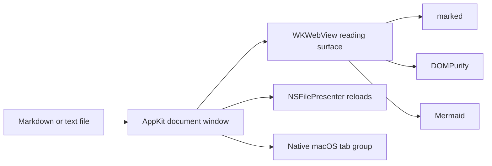

<p align="center">
  
</p>

<h1 align="center">Satr</h1>

<p align="center">
  A small native macOS reader for Markdown, Mermaid, and plain text.
  <br>
  <em>سطر</em> means “line” in Arabic.
</p>

Satr gives local documents a focused reading surface without turning them into a browser tab or opening a full editor. It is a native AppKit application with an offline rendering stack, Finder integration, and document tabs that behave like macOS windows should.

Built by Hatim as a personal tool, with the source kept intentionally small and understandable.

## What makes it Satr

- **Native document tabs.** Open several files together, reorder them, drag a tab into its own window, and merge it back by hand.
- **A reading thread.** Headings become quiet navigation points along the left edge, with progress tied to the document's real scroll range.
- **Mermaid included.** Flowcharts and sequence diagrams render locally without a network dependency.
- **Vault-aware links.** Normal Markdown links and Obsidian-style `[[wiki links]]` open in the current tab group.
- **Text stays text.** `.txt` files preserve their symbols, spacing, line breaks, and bidirectional content instead of being interpreted as Markdown.
- **Arabic and English together.** Direction is resolved per block so mixed-language documents remain readable.
- **Finder-native.** Satr can be selected through **Open With** and registered as the default opener for supported files.

## Supported documents

| Format | Behavior |
| --- | --- |
| `.md`, `.markdown`, `.mdown`, `.mkd` | GitHub-flavored Markdown, tables, task lists, code, links, local media, and Mermaid |
| `.txt` | Literal plain text with preserved whitespace and automatic text direction |

YAML frontmatter is hidden in reading view. Files reload automatically when another application changes them on disk.

## Tabs and windows

- `Command-T` opens a document in a new tab.
- `Command-N` opens a document in a separate window.
- `Control-Tab` and `Control-Shift-Tab` move between tabs.
- Drag a tab outside its window to detach it.
- Drag it onto another visible Satr tab bar to merge it by hand.
- Choose **Window > Merge All Windows** to combine every Satr window at once.

Single-document windows keep their tab bar visible, so a detached tab always has a clear place to return.

## How it works



Each document owns its own renderer, file presenter, zoom level, scroll position, and window. macOS provides the tab grouping, reordering, detaching, and merging behavior. Satr provides the reading interface inside each document window.

## Build from source

Requirements:

- macOS 14 or later
- Apple Silicon Mac
- Xcode command-line tools
- Node.js and npm for the bundled browser libraries

```sh
git clone <repository-url>
cd Satr
npm ci

mkdir -p Resources/vendor
cp node_modules/marked/lib/marked.umd.js Resources/vendor/marked.js
cp node_modules/dompurify/dist/purify.min.js Resources/vendor/purify.min.js
cp node_modules/mermaid/dist/mermaid.min.js Resources/vendor/mermaid.min.js

Scripts/build.sh --install
```

The build script compiles an optimized arm64 binary, creates the app icon, assembles `/Applications/Satr.app`, and applies an ad-hoc signature. The installed bundle identifier is `com.satr.reader`.

## Project map

```text
Sources/Satr/       AppKit windows, file handling, and rendering bridge
Resources/          Reading surface, styles, and bundled renderers
Scripts/            Repeatable app build and icon generation
Tests/Fixtures/     Markdown, Mermaid, local-image, link, and text fixtures
```

The application does not use Electron, a package manager for Swift, an Xcode project, analytics, accounts, or a server.

## Privacy

Document content is rendered locally. The Markdown parser, sanitizer, Mermaid renderer, wiki-link resolver, and local media handler work without a network connection.

Remote images and media referenced by a document load automatically, just as they do in a browser. Opening an untrusted document can therefore contact its remote host and reveal ordinary request metadata such as IP address and access time. No document text is uploaded by Satr.

## Renderer dependencies

- [marked](https://github.com/markedjs/marked) 18.0.7, MIT
- [DOMPurify](https://github.com/cure53/DOMPurify) 3.4.12, MPL-2.0 or Apache-2.0
- [Mermaid](https://github.com/mermaid-js/mermaid) 11.16.0, MIT

These libraries are bundled so documents render offline. Their license texts should be retained in any redistributed source or application bundle.

## Project license

No license has been selected for Satr yet. Until one is added, the source is visible but remains under normal copyright restrictions.
