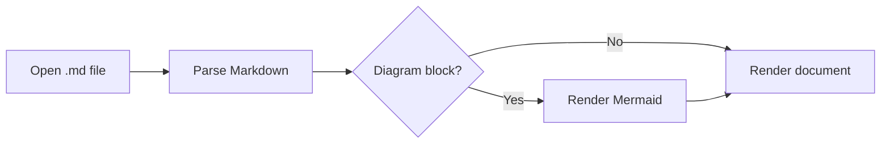
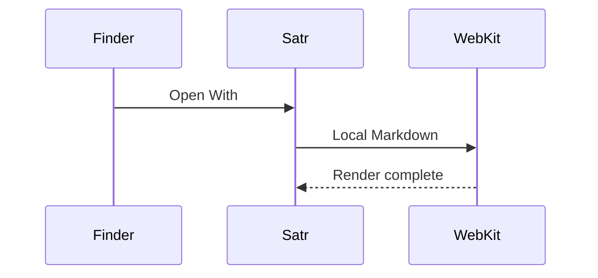

# A clear place for Markdown

Satr renders ordinary prose, **strong text**, *emphasis*, `inline code`, [web links](https://example.com), and [[Linked Note|wiki links]]. It also handles العربية in the same document.

> A blockquote should stay quiet and readable. It carries meaning without becoming a decorative card.

## A practical checklist

- [x] GitHub-flavored task lists
- [x] Tables
- [x] Fenced code
- [ ] Final visual inspection

| Capability | Expected result |
|---|---|
| Mermaid | Rendered diagram |
| Relative images | Loaded beside the note |
| Direction | Arabic and English align naturally |

```swift
struct Document {
    let title: String
    let markdown: String
}
```

## Mermaid flow



### Sequence example



## Local image


## Arabic content

هذا سطر عربي للتأكد من اتجاه النص والقراءة الطبيعية داخل نفس المستند.

1. النص يبدأ من اليمين.
2. الكود والأسماء الإنجليزية تبقى واضحة.
3. المخططات تظهر ضمن سياق المستند.
